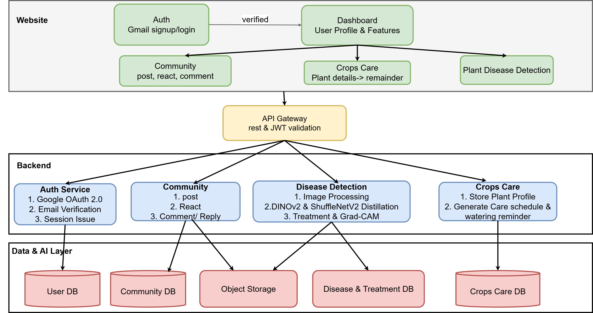

# PlantCheck

PlantCheck — Smart Agriculture Platform

- Plant disease diagnosis powered by a DINOv2 + CLIP feature-fusion model, achieving 78.83% accuracy on the PlantWild dataset.
- Crop journals, watering reminders, weather information, and crop care tools.
- Community posts, comments, authentication, and diagnosis history.

## System Architecture

<p align="center">
  
</p>

## Requirements

Install these before starting the project:

- Node.js 18 or newer and npm.
- Python 3.10 or newer.
- MongoDB Atlas or another MongoDB database.
- Git.

The model files and class labels are included in `backend/models`. The prediction service uses
`fusion_head_final.pth` by default; `best.pth` is also present as a legacy ShuffleNetV2 checkpoint.
The DINOv2 and CLIP backbones are loaded through Hugging Face Transformers on first use.

```text
backend/models/fusion_head_final.pth
backend/models/class.json
```

## First-time setup

Open PowerShell in the project folder and install the Node dependencies:

```powershell
cd frontend
npm install
cd backend
npm install

```

Create a `.env` file in the project root. and open your `.env` and set at least these values:

```env
PORT=3003
CLIENT_URL=http://localhost:5173
VITE_API_URL=http://localhost:3003
MONGO_URI=your-mongodb-connection-string
JWT_SECRET=replace-with-a-long-random-secret
GOOGLE_CLIENT_ID=your-google-oauth-client-id
GMAIL_USER=your-email@gmail.com
GMAIL_APP_PASSWORD=your-gmail-app-password
```

`GOOGLE_CLIENT_ID` is needed for Google sign-in. `GMAIL_USER` and `GMAIL_APP_PASSWORD` are needed
to send verification and password-reset emails. Never commit real passwords, API keys, or database
credentials.

Install the Python prediction dependencies. A virtual environment is recommended:

```powershell
python -m venv .venv
.\.venv\Scripts\Activate.ps1
python -m pip install --upgrade pip
python -m pip install -r backend\requirements.txt
```

## Start the project

Use two PowerShell terminals.

### Terminal 1: backend

From the project folder:

```powershell
cd backend
npm run dev
```

The backend starts at `http://localhost:3003`. It automatically starts the Python prediction
service at `http://localhost:8000`, so you do not need to run Uvicorn separately.

### Terminal 2: frontend

```powershell
cd frontend
npm run dev
```

Open the URL shown by Vite, normally:

```text
http://localhost:5173
```

## Useful URLs

| Service | URL |
| --- | --- |
| Frontend | http://localhost:5173 |
| Backend health | http://localhost:3003/api/health |
| Prediction health | http://localhost:8000/health |


## Production build

Build the frontend with:

```powershell
cd frontend
npm run build
```

To lint the frontend:

```powershell
npm run lint
```
## References

1. Wei, T., Chen, Z., Huang, Z., & Yu, X. (2024).
   *Benchmarking In-the-Wild Multimodal Plant Disease Recognition and A Versatile Baseline.*
   ACM International Conference on Multimedia.
